# 5-VE-B-SD4-515-2025-II
## UNIDAD III
### Tarea 7.0: Ciclo CI/CD - Explicación Detallada y Ejemplo Práctico

---

## 📚 Tabla de Contenidos
1. [Introducción al CI/CD](#introducción-al-cicd)
2. [Componentes del Ciclo CI/CD](#componentes-del-ciclo-cicd)
3. [Ejemplo Práctico: Calculadora Python](#ejemplo-práctico-calculadora-python)
4. [Configuración del Proyecto](#configuración-del-proyecto)
5. [Implementación de Pruebas](#implementación-de-pruebas)
6. [Pipeline CI/CD con GitHub Actions](#pipeline-cicd-con-github-actions)
7. [Construcción del Package](#construcción-del-package)
8. [Cómo Ejecutar el Proyecto](#cómo-ejecutar-el-proyecto)

---

## 📖 Introducción al CI/CD

**CI/CD** (Continuous Integration/Continuous Delivery) es una metodología de desarrollo de software que automatiza el proceso de integración, pruebas y despliegue de código.

### ¿Qué es CI (Integración Continua)?
La Integración Continua es la práctica de fusionar todos los cambios de código en una rama central varias veces al día. Cada integración se verifica mediante una compilación automatizada y pruebas automatizadas.

### ¿Qué es CD (Entrega/Despliegue Continuo)?
- **Entrega Continua**: Automatiza la entrega de aplicaciones a entornos de prueba o staging.
- **Despliegue Continuo**: Va un paso más allá, desplegando automáticamente a producción.

---

## 🔄 Componentes del Ciclo CI/CD

```mermaid
graph LR
    A[Código] --> B[Build/Compilación]
    B --> C[Pruebas Automatizadas]
    C --> D[Análisis de Calidad]
    D --> E[Empaquetado]
    E --> F[Despliegue]
    F --> G[Monitoreo]
```



### Fases Detalladas:

1. **Source (Código Fuente)**
   - Desarrolladores escriben y commitean código
   - Control de versiones con Git
   - Pull Requests y revisiones de código

2. **Build (Construcción)**
   - Compilación del código
   - Resolución de dependencias
   - Generación de artefactos

3. **Test (Pruebas)**
   - Pruebas unitarias
   - Pruebas de integración
   - Pruebas de cobertura

4. **Package (Empaquetado)**
   - Creación de artefactos distribuibles
   - Versionado semántico
   - Publicación en registros

5. **Deploy (Despliegue)**
   - Despliegue automatizado
   - Configuración de entornos
   - Rollback automático si falla

---

## 💻 Ejemplo Práctico: Calculadora Python

Vamos a crear una aplicación de calculadora simple en Python para demostrar todo el ciclo CI/CD.

### Estructura del Proyecto
```
python-calculator/
├── .github/
│   └── workflows/
│       └── ci-cd.yml
├── src/
│   ├── __init__.py
│   └── calculator.py
├── tests/
│   ├── __init__.py
│   └── test_calculator.py
├── requirements.txt
├── setup.py
├── README.md
└── .gitignore
```

---

## 🛠️ Configuración del Proyecto

### 1. Código Principal (`src/calculator.py`)

```python
"""
Módulo de calculadora simple para demostrar CI/CD
"""

class Calculator:
    """Clase que implementa operaciones matemáticas básicas"""
    
    def __init__(self):
        """Inicializa la calculadora"""
        self.result = 0
    
    def add(self, a, b):
        """
        Suma dos números
        
        Args:
            a (float): Primer número
            b (float): Segundo número
        
        Returns:
            float: Resultado de la suma
        """
        return a + b
    
    def subtract(self, a, b):
        """
        Resta dos números
        
        Args:
            a (float): Minuendo
            b (float): Sustraendo
        
        Returns:
            float: Resultado de la resta
        """
        return a - b
    
    def multiply(self, a, b):
        """
        Multiplica dos números
        
        Args:
            a (float): Primer factor
            b (float): Segundo factor
        
        Returns:
            float: Resultado de la multiplicación
        """
        return a * b
    
    def divide(self, a, b):
        """
        Divide dos números
        
        Args:
            a (float): Dividendo
            b (float): Divisor
        
        Returns:
            float: Resultado de la división
        
        Raises:
            ValueError: Si el divisor es cero
        """
        if b == 0:
            raise ValueError("No se puede dividir por cero")
        return a / b
    
    def power(self, base, exponent):
        """
        Calcula la potencia de un número
        
        Args:
            base (float): Base
            exponent (float): Exponente
        
        Returns:
            float: Resultado de la potenciación
        """
        return base ** exponent
```

### 2. Archivo de Dependencias (`requirements.txt`)

```
pytest==7.4.3
pytest-cov==4.1.0
flake8==6.1.0
black==23.11.0
wheel==0.41.3
setuptools==68.2.2
```

### 3. Configuración del Package (`setup.py`)

```python
from setuptools import setup, find_packages

with open("README.md", "r", encoding="utf-8") as fh:
    long_description = fh.read()

setup(
    name="python-calculator-cicd",
    version="1.0.0",
    author="Tu Nombre",
    author_email="tu.email@ejemplo.com",
    description="Una calculadora simple para demostrar CI/CD",
    long_description=long_description,
    long_description_content_type="text/markdown",
    url="https://github.com/tuusuario/python-calculator",
    packages=find_packages(where="src"),
    package_dir={"": "src"},
    classifiers=[
        "Development Status :: 3 - Alpha",
        "Intended Audience :: Developers",
        "Topic :: Software Development :: Build Tools",
        "License :: OSI Approved :: MIT License",
        "Programming Language :: Python :: 3",
        "Programming Language :: Python :: 3.8",
        "Programming Language :: Python :: 3.9",
        "Programming Language :: Python :: 3.10",
    ],
    python_requires=">=3.8",
    install_requires=[],
    extras_require={
        "dev": [
            "pytest>=7.0",
            "pytest-cov>=4.0",
            "flake8>=6.0",
            "black>=23.0",
        ]
    },
)
```

---

## 🧪 Implementación de Pruebas

### Pruebas Unitarias (`tests/test_calculator.py`)

```python
"""
Pruebas unitarias para el módulo calculator
"""

import pytest
from src.calculator import Calculator


class TestCalculator:
    """Clase de pruebas para Calculator"""
    
    def setup_method(self):
        """Configuración antes de cada prueba"""
        self.calc = Calculator()
    
    def test_add(self):
        """Prueba la función de suma"""
        assert self.calc.add(2, 3) == 5
        assert self.calc.add(-1, 1) == 0
        assert self.calc.add(0, 0) == 0
        assert self.calc.add(1.5, 2.5) == 4.0
    
    def test_subtract(self):
        """Prueba la función de resta"""
        assert self.calc.subtract(5, 3) == 2
        assert self.calc.subtract(0, 5) == -5
        assert self.calc.subtract(-3, -3) == 0
        assert self.calc.subtract(10.5, 0.5) == 10.0
    
    def test_multiply(self):
        """Prueba la función de multiplicación"""
        assert self.calc.multiply(3, 4) == 12
        assert self.calc.multiply(0, 100) == 0
        assert self.calc.multiply(-2, 3) == -6
        assert self.calc.multiply(2.5, 2) == 5.0
    
    def test_divide(self):
        """Prueba la función de división"""
        assert self.calc.divide(10, 2) == 5
        assert self.calc.divide(7, 2) == 3.5
        assert self.calc.divide(-10, 2) == -5
        assert self.calc.divide(1, 3) == pytest.approx(0.3333, 0.001)
    
    def test_divide_by_zero(self):
        """Prueba que la división por cero lance una excepción"""
        with pytest.raises(ValueError) as excinfo:
            self.calc.divide(10, 0)
        assert "No se puede dividir por cero" in str(excinfo.value)
    
    def test_power(self):
        """Prueba la función de potenciación"""
        assert self.calc.power(2, 3) == 8
        assert self.calc.power(5, 0) == 1
        assert self.calc.power(10, -1) == 0.1
        assert self.calc.power(9, 0.5) == 3


class TestCalculatorIntegration:
    """Pruebas de integración para operaciones complejas"""
    
    def setup_method(self):
        """Configuración antes de cada prueba"""
        self.calc = Calculator()
    
    def test_complex_operation(self):
        """Prueba una operación compleja combinando varias funciones"""
        # (10 + 5) * 2 - 8 / 4
        result1 = self.calc.add(10, 5)  # 15
        result2 = self.calc.multiply(result1, 2)  # 30
        result3 = self.calc.divide(8, 4)  # 2
        final = self.calc.subtract(result2, result3)  # 28
        assert final == 28
    
    def test_chain_operations(self):
        """Prueba encadenamiento de operaciones"""
        # 2^3 + 10 - 5 * 2
        power_result = self.calc.power(2, 3)  # 8
        sum_result = self.calc.add(power_result, 10)  # 18
        mult_result = self.calc.multiply(5, 2)  # 10
        final = self.calc.subtract(sum_result, mult_result)  # 8
        assert final == 8


# Pruebas parametrizadas
@pytest.mark.parametrize("a,b,expected", [
    (2, 3, 5),
    (0, 0, 0),
    (-1, -1, -2),
    (100, 200, 300),
    (1.5, 2.5, 4.0),
])
def test_add_parametrized(a, b, expected):
    """Prueba parametrizada para la suma"""
    calc = Calculator()
    assert calc.add(a, b) == expected
```

---

## 🚀 Pipeline CI/CD con GitHub Actions

### Archivo de Workflow (`.github/workflows/ci-cd.yml`)

```yaml
name: CI/CD Pipeline

# Eventos que disparan el workflow
on:
  push:
    branches: [ main, develop ]
  pull_request:
    branches: [ main ]
  release:
    types: [created]

jobs:
  # Job de Linting y Formato
  lint:
    name: Linting y Formato de Código
    runs-on: ubuntu-latest
    
    steps:
    - name: Checkout código
      uses: actions/checkout@v3
    
    - name: Configurar Python
      uses: actions/setup-python@v4
      with:
        python-version: '3.10'
    
    - name: Instalar dependencias de linting
      run: |
        python -m pip install --upgrade pip
        pip install flake8 black
    
    - name: Ejecutar Flake8
      run: |
        # Detener el build si hay errores de sintaxis o variables no definidas
        flake8 . --count --select=E9,F63,F7,F82 --show-source --statistics
        # exit-zero trata todos los errores como advertencias
        flake8 . --count --exit-zero --max-complexity=10 --max-line-length=127 --statistics
    
    - name: Verificar formato con Black
      run: |
        black --check src/ tests/

  # Job de Testing
  test:
    name: Pruebas Automatizadas
    runs-on: ubuntu-latest
    needs: lint
    strategy:
      matrix:
        python-version: ['3.8', '3.9', '3.10', '3.11']
    
    steps:
    - name: Checkout código
      uses: actions/checkout@v3
    
    - name: Configurar Python ${{ matrix.python-version }}
      uses: actions/setup-python@v4
      with:
        python-version: ${{ matrix.python-version }}
    
    - name: Cache de dependencias
      uses: actions/cache@v3
      with:
        path: ~/.cache/pip
        key: ${{ runner.os }}-pip-${{ hashFiles('**/requirements.txt') }}
        restore-keys: |
          ${{ runner.os }}-pip-
    
    - name: Instalar dependencias
      run: |
        python -m pip install --upgrade pip
        pip install -r requirements.txt
        pip install -e .
    
    - name: Ejecutar pruebas unitarias
      run: |
        pytest tests/ -v --cov=src --cov-report=xml --cov-report=html --cov-report=term
    
    - name: Verificar cobertura mínima
      run: |
        coverage report --fail-under=80
    
    - name: Subir reporte de cobertura
      uses: actions/upload-artifact@v3
      with:
        name: coverage-report-${{ matrix.python-version }}
        path: htmlcov/
    
    - name: Subir a Codecov
      uses: codecov/codecov-action@v3
      with:
        file: ./coverage.xml
        flags: unittests
        name: codecov-umbrella

  # Job de Análisis de Seguridad
  security:
    name: Análisis de Seguridad
    runs-on: ubuntu-latest
    needs: lint
    
    steps:
    - name: Checkout código
      uses: actions/checkout@v3
    
    - name: Configurar Python
      uses: actions/setup-python@v4
      with:
        python-version: '3.10'
    
    - name: Instalar Bandit
      run: |
        python -m pip install --upgrade pip
        pip install bandit
    
    - name: Ejecutar análisis de seguridad
      run: |
        bandit -r src/ -f json -o bandit-report.json
    
    - name: Subir reporte de seguridad
      uses: actions/upload-artifact@v3
      with:
        name: security-report
        path: bandit-report.json

  # Job de Build y Package
  build:
    name: Construir Package
    runs-on: ubuntu-latest
    needs: [test, security]
    
    steps:
    - name: Checkout código
      uses: actions/checkout@v3
    
    - name: Configurar Python
      uses: actions/setup-python@v4
      with:
        python-version: '3.10'
    
    - name: Instalar dependencias de build
      run: |
        python -m pip install --upgrade pip
        pip install build wheel setuptools
    
    - name: Construir distribución
      run: |
        python -m build
    
    - name: Verificar archivos construidos
      run: |
        ls -la dist/
        pip install twine
        twine check dist/*
    
    - name: Subir artefactos de build
      uses: actions/upload-artifact@v3
      with:
        name: python-package
        path: dist/

  # Job de Release (solo en tags)
  release:
    name: Publicar Package
    runs-on: ubuntu-latest
    needs: build
    if: github.event_name == 'release'
    
    steps:
    - name: Checkout código
      uses: actions/checkout@v3
    
    - name: Configurar Python
      uses: actions/setup-python@v4
      with:
        python-version: '3.10'
    
    - name: Descargar artefactos
      uses: actions/download-artifact@v3
      with:
        name: python-package
        path: dist/
    
    - name: Publicar a Test PyPI
      env:
        TWINE_USERNAME: __token__
        TWINE_PASSWORD: ${{ secrets.TEST_PYPI_API_TOKEN }}
      run: |
        pip install twine
        twine upload --repository testpypi dist/*
    
    - name: Publicar a PyPI
      if: github.event.release.prerelease == false
      env:
        TWINE_USERNAME: __token__
        TWINE_PASSWORD: ${{ secrets.PYPI_API_TOKEN }}
      run: |
        twine upload dist/*

  # Job de Docker (opcional)
  docker:
    name: Construir y Publicar Imagen Docker
    runs-on: ubuntu-latest
    needs: build
    if: github.ref == 'refs/heads/main'
    
    steps:
    - name: Checkout código
      uses: actions/checkout@v3
    
    - name: Configurar Docker Buildx
      uses: docker/setup-buildx-action@v2
    
    - name: Login a Docker Hub
      uses: docker/login-action@v2
      with:
        username: ${{ secrets.DOCKER_USERNAME }}
        password: ${{ secrets.DOCKER_PASSWORD }}
    
    - name: Construir y publicar imagen
      uses: docker/build-push-action@v4
      with:
        context: .
        push: true
        tags: |
          ${{ secrets.DOCKER_USERNAME }}/python-calculator:latest
          ${{ secrets.DOCKER_USERNAME }}/python-calculator:${{ github.sha }}
```

---

## 📦 Construcción del Package

### Proceso de Empaquetado Detallado

1. **Preparación del Entorno**
   ```bash
   python -m venv venv
   source venv/bin/activate  # Linux/Mac
   # o
   venv\Scripts\activate  # Windows
   ```

2. **Instalación de Herramientas de Build**
   ```bash
   pip install --upgrade pip
   pip install build wheel setuptools twine
   ```

3. **Construcción del Package**
   ```bash
   python -m build
   ```
   
   Esto genera dos tipos de distribuciones:
   - **Source Distribution (sdist)**: `dist/python-calculator-cicd-1.0.0.tar.gz`
   - **Wheel Distribution**: `dist/python_calculator_cicd-1.0.0-py3-none-any.whl`

4. **Verificación del Package**
   ```bash
   twine check dist/*
   ```

5. **Estructura del Package Generado**
   ```
   dist/
   ├── python-calculator-cicd-1.0.0.tar.gz
   └── python_calculator_cicd-1.0.0-py3-none-any.whl
   ```

### Contenido del Package

El package incluye:
- Código fuente de la aplicación
- Metadatos del proyecto (nombre, versión, autor, etc.)
- Dependencias requeridas
- Documentación (README)
- Licencia

---

## 🎯 Cómo Ejecutar el Proyecto

### 1. Clonar el Repositorio
```bash
git clone https://github.com/tuusuario/python-calculator.git
cd python-calculator
```

### 2. Crear Entorno Virtual
```bash
python -m venv venv
source venv/bin/activate  # Linux/Mac
# o
venv\Scripts\activate  # Windows
```

### 3. Instalar Dependencias
```bash
pip install -r requirements.txt
pip install -e .  # Instalar en modo desarrollo
```

### 4. Ejecutar Pruebas Localmente
```bash
# Pruebas básicas
pytest

# Pruebas con cobertura
pytest --cov=src --cov-report=html

# Pruebas con verbose
pytest -v

# Prueba específica
pytest tests/test_calculator.py::TestCalculator::test_add
```

### 5. Verificar Calidad del Código
```bash
# Linting
flake8 src/ tests/

# Formato
black src/ tests/

# Análisis de seguridad
bandit -r src/
```

### 6. Construir el Package Localmente
```bash
python -m build
```

---

## 📊 Métricas y Reportes

### Cobertura de Código
El pipeline genera reportes de cobertura que muestran:
- Porcentaje de líneas cubiertas
- Ramas no cubiertas
- Archivos con baja cobertura

### Métricas de Calidad
- **Complejidad Ciclomática**: Medida por flake8
- **Estilo de Código**: Verificado por Black
- **Vulnerabilidades**: Detectadas por Bandit

---

## 🔧 Configuración Adicional

### `.gitignore`
```gitignore
# Python
__pycache__/
*.py[cod]
*$py.class
*.so
.Python
venv/
env/
ENV/

# Testing
.coverage
.pytest_cache/
htmlcov/
*.cover
.hypothesis/

# Build
build/
develop-eggs/
dist/
downloads/
eggs/
.eggs/
lib/
lib64/
parts/
sdist/
var/
wheels/
*.egg-info/
.installed.cfg
*.egg

# IDE
.idea/
.vscode/
*.swp
*.swo

# OS
.DS_Store
Thumbs.db
```

### `pytest.ini`
```ini
[tool:pytest]
testpaths = tests
python_files = test_*.py
python_classes = Test*
python_functions = test_*
addopts = -ra -q --strict-markers
markers =
    slow: marks tests as slow (deselect with '-m "not slow"')
    integration: marks tests as integration tests
```

---

## 🚦 Estados del Pipeline

### Badge de Estado
```markdown

```

### Interpretación de Estados
- ✅ **Verde**: Todas las pruebas pasaron exitosamente
- 🔴 **Rojo**: Alguna prueba falló
- 🟡 **Amarillo**: Pipeline en ejecución
- ⚪ **Gris**: No se ha ejecutado el pipeline

---

## 📈 Beneficios del CI/CD Implementado

1. **Detección Temprana de Errores**: Las pruebas automáticas detectan problemas inmediatamente
2. **Calidad Consistente**: El código siempre cumple con los estándares definidos
3. **Despliegue Confiable**: Los packages se construyen de forma consistente
4. **Documentación Automática**: Los reportes se generan automáticamente
5. **Colaboración Mejorada**: Todo el equipo puede ver el estado del proyecto
6. **Historial de Cambios**: Cada commit está respaldado por pruebas
7. **Rollback Fácil**: Si algo falla, es fácil volver a una versión anterior

---

## 🎓 Conclusión

Este proyecto demuestra un ciclo completo de CI/CD que incluye:

1. **Integración Continua**
   - Análisis de código estático (linting)
   - Formato de código consistente
   - Pruebas automatizadas
   - Análisis de seguridad
   - Reporte de cobertura

2. **Entrega Continua**
   - Construcción automatizada de packages
   - Verificación de artefactos
   - Publicación en repositorios
   - Generación de imágenes Docker

3. **Mejores Prácticas**
   - Versionado semántico
   - Documentación completa
   - Pruebas en múltiples versiones de Python
   - Cache de dependencias
   - Artefactos almacenados

El pipeline garantiza que cada cambio en el código sea probado, verificado y empaquetado correctamente antes de ser integrado en la rama principal o desplegado a producción.

---

## 📚 Referencias

- [GitHub Actions Documentation](https://docs.github.com/en/actions)
- [Python Packaging Guide](https://packaging.python.org/)
- [pytest Documentation](https://docs.pytest.org/)
- [Continuous Integration Best Practices](https://www.atlassian.com/continuous-delivery/continuous-integration)

---

## 📝 Licencia

Este proyecto está bajo la Licencia MIT - ver el archivo LICENSE para más detalles.

---

## 👤 Autor

**Tu Nombre**
- GitHub: [@tuusuario](https://github.com/tuusuario)
- Email: tu.email@ejemplo.com

---

*Proyecto creado para la Tarea 7.0 - UNIDAD III - Curso 5-VE-B-SD4-515-2025-II*
